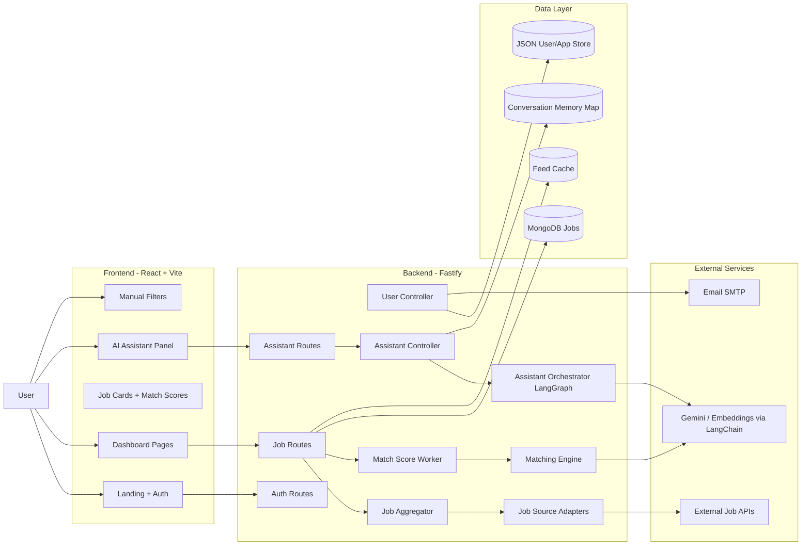

# Jobsbazaar - AI Job Tracker with LangChain Matching and LangGraph Assistant

Jobsbazaar is an AI-powered job platform that combines multi-source live jobs, resume/profile-based match scoring, application tracking, and an assistant that can directly control dashboard filters.

## 1. Live Deployment (Mandatory)
- Frontend (public): https://jobsbazaar-yksn.vercel.app/
- Backend API (public): https://jobsbazaar-1.onrender.com
- Works on desktop and mobile (responsive dashboard + landing pages)

## 2. GitHub Repository (Mandatory)
- Public repository: https://github.com/RACHAMADUGUSIVASANKAR/Jobsbazaar
- Clean folder structure: separate frontend and backend projects
- Meaningful commits: feature-based incremental history
- Environment templates present:
  - `backend/.env.example`
  - `frontend/.env.example`
- No secrets committed: runtime credentials are injected through environment variables

---

## README Deliverables

## a) Architecture Diagram

### System Architecture (Frontend + Backend + AI + External APIs)



### Data Flow Summary
1. Job fetch flow:
- Job source adapters call external APIs.
- Jobs are normalized, deduplicated, categorized, and stored.
- Match worker computes `matchScore` + explanation and updates active jobs.

2. Assistant filter flow:
- User message goes to LangGraph orchestrator.
- Intent + action payload is produced.
- Assistant returns tool-style action (`setFilters`, `resetFilters`, etc.).
- Frontend applies filters and refreshes feed immediately.

---

## b) Setup Instructions

### Prerequisites
- Node.js 18+
- npm 9+
- MongoDB (Atlas or local)
- Optional keys:
  - Adzuna API credentials
  - Gemini API key
  - SMTP credentials

### Local Setup

```bash
# 1) Install dependencies
cd backend
npm install

cd ../frontend
npm install

# 2) Configure environment
# copy examples and fill values
# backend/.env.example -> backend/.env
# frontend/.env.example -> frontend/.env

# 3) Run backend (port 3002)
cd ../backend
npm run dev

# 4) Run frontend (vite)
cd ../frontend
npm run dev
```

### Environment Variables

#### Backend (`backend/.env`)
From `backend/.env.example`:
- `NODE_ENV`
- `PORT`
- `JWT_SECRET`
- `MONGODB_URI`
- `FRONTEND_URL`
- `CORS_ORIGINS`
- `CORS_ALLOW_VERCEL_PREVIEWS`
- `GOOGLE_CLIENT_ID` (optional)
- `GOOGLE_CLIENT_SECRET` (optional)
- `GOOGLE_REDIRECT_URI` (optional)
- `SMTP_HOST` (optional)
- `SMTP_PORT` (optional)
- `SMTP_USER` (optional)
- `SMTP_PASS` (optional)
- `ADZUNA_APP_ID` (optional but recommended)
- `ADZUNA_APP_KEY` (optional but recommended)
- `GEMINI_API_KEY` (optional for LLM-enhanced flows)
- `JOB_FEED_COUNTRIES`
- `JOB_FEED_PAGES_PER_COUNTRY`
- `JOB_SOURCES`

#### Frontend (`frontend/.env`)
From `frontend/.env.example`:
- `VITE_API_BASE_URL`
- `VITE_LOCAL_API_TARGET`

### Security Notes
- Never commit real `.env` files.
- Only commit `.env.example` templates.
- Rotate secrets if exposed.

---

## c) LangChain & LangGraph Usage

### LangChain for Matching
LangChain is used in the matching pipeline for semantic understanding:
- Chat/embedding models are initialized through LangChain wrappers.
- Matching engine computes semantic relevance + explicit overlap boosts.
- Cached analysis and vector paths reduce repeated LLM/embedding calls.

Core implementation files:
- `backend/src/utils/matchingEngine.js`
- `backend/src/workers/matchScoreWorker.js`

### LangGraph for Assistant Orchestration
Assistant is built as a LangGraph state graph.

Graph state includes:
- user message
- normalized input
- context filters
- history
- parsed intent/action
- response

Graph nodes:
- `input`
- `intent`
- `classifyIntent`
- `action`
- `respond`

Conditional behavior:
- deterministic quick-path can skip full LLM path when intent is obvious
- otherwise graph classifies intent then dispatches action

Core implementation file:
- `backend/src/utils/assistantOrchestrator.js`

### Tool / Function Calling for UI Filter Updates
Assistant action layer supports operations such as:
- `setFilters`
- `resetFilters`
- `updateMatchScoreFilter`
- `searchBySkill`
- `searchByLocation`

The frontend listens and applies these updates to feed filters immediately, so manual + AI filtering coexist without conflict.

### Prompt Design
Prompt contract enforces structured assistant output (JSON-first behavior), including intent and filter payloads. This makes frontend action handling deterministic and minimizes hallucinated UI operations.

### State Management Approach
- Backend keeps a bounded per-user conversation memory window.
- Frontend keeps active filters as source of truth in Job Feed.
- Assistant receives current filter context, returns deltas, and UI merges state safely.

---

## d) AI Matching Logic

### Scoring Approach
Current matching combines:
1. Semantic relevance (embedding/text similarity)
2. Skill overlap boost
3. Keyword overlap boost
4. Fallback heuristic when embeddings are unavailable

Output per job includes:
- `matchScore` (0-100)
- `matchExplanation`
- matching/missing skills context

### Why It Works
- Semantic layer catches meaning beyond exact keywords.
- Explicit overlap preserves controllable, explainable ranking behavior.
- Resume-first corpus improves personalization quality.

### Matching Priority Rule
- If resume exists: use resume-derived corpus first.
- Else: use structured profile data (skills, role, preferences) as fallback.

### Performance Considerations
- Chunked scoring worker for active jobs
- Bulk DB writes for score updates
- Feed caching to reduce repeated expensive computation
- Background refresh instead of blocking request path

---

## e) Popup Flow Design (Critical Thinking)

### Why This Design
Application popup appears after apply actions to capture user intent and keep tracking data reliable without interrupting the core browsing flow.

### Edge Cases Handled
- user closes popup without final answer
- user already applied earlier
- network errors while submitting decision
- duplicate decisions for same job
- quick browsing with multiple apply openings

### Alternative Approaches Considered
1. No popup (rejected): weak tracking accuracy
2. Mandatory full-page confirmation (rejected): heavy UX interruption
3. Inline card-only confirmation (rejected): less discoverable for decision logging

Chosen approach balances data quality with low friction UX.

---

## f) AI Assistant UI Choice

### Chosen Pattern
Floating button + slide-in assistant panel.

### UX Reasoning
- Preserves dashboard real estate for job list and filters.
- Keeps assistant always accessible but non-intrusive.
- Works well on mobile (drawer/bottom-sheet style behavior) and desktop.
- Better than permanent sidebar chat for job-focused workflows.

---

## g) Scalability

### How it handles 100+ jobs (current)
- pagination + virtualized rendering strategy in feed
- background score refresh worker
- dedupe + normalization during ingestion
- cached feed responses

### Path to 10,000 users
- move all user/application state fully to MongoDB
- introduce Redis for distributed caching/session memory
- queue-based workers for scoring and notifications
- horizontal backend scaling with stateless API instances
- stronger DB indexing on filter and score fields

---

## h) Tradeoffs

### Known Limitations
- Mixed storage model (Mongo for jobs + JSON store for some user/application flows) increases operational complexity.
- In-memory conversation memory is not distributed across multiple backend instances.
- External API reliability and quotas can impact freshness.
- LLM-enhanced features depend on provider availability and key configuration.

### What We Would Improve with More Time
- fully unified persistence layer (single DB strategy)
- distributed conversation memory
- richer tracing/observability for assistant actions
- stronger evaluation harness for matching quality benchmarking
- advanced adaptive ranking beyond static boosts

---

## Evaluation Criteria Mapping

### Must-Have
- Live link working: Yes
- GitHub repo public: Yes
- LangChain used for matching: Yes
- LangGraph used for assistant: Yes
- Filters work (manual + AI): Yes
- Match scores visible: Yes
- Smart popup flow implemented: Yes
- AI controls UI filters: Yes

### What We Optimized For
- Product sense: assistant + tracking integrated into main flow
- Clean architecture: layered frontend/backend orchestration
- Proper AI orchestration: deterministic actions + graph-based routing
- UX quality: responsive dashboard, mobile-first updates, slide panel assistant
- Code readability: modular services/controllers/workers
- Real-world thinking: fallback paths, error handling, and scaling roadmap

---

## Bonus Points Coverage
- Advanced LangGraph behavior (conditional pathing): Yes
- Conversation memory window: Yes
- Smooth UI animations/transitions: Yes
- Voice input support: Yes
- Mobile-first design improvements: Yes
- Creative extras (application tracking + insights): Yes

---

## Final Submission Checklist
- Live link works on desktop and mobile: Yes
- GitHub repo is public: Yes
- README includes architecture diagram: Yes
- LangChain implemented: Yes
- LangGraph implemented: Yes
- AI controls filters: Yes
- Match scores visible: Yes
- Application tracking works: Yes
- No secrets in code: Yes

---

## Deployment Quick Access
- Frontend: https://jobsbazaar-yksn.vercel.app/
- Backend: https://jobsbazaar-1.onrender.com
- Repository: https://github.com/RACHAMADUGUSIVASANKAR/Jobsbazaar

